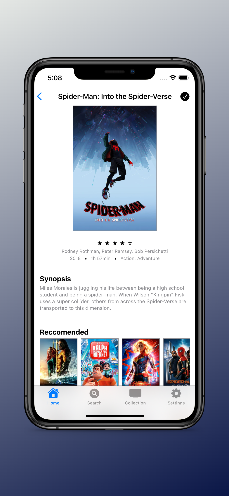
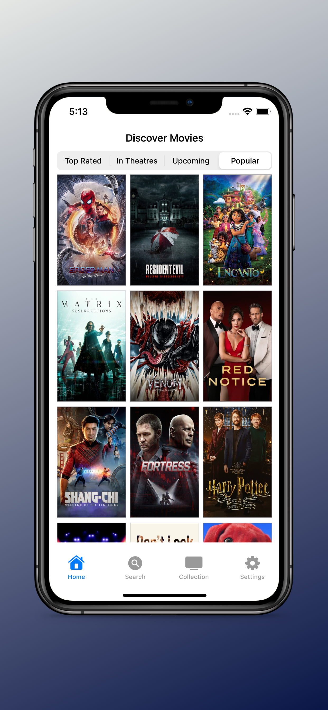
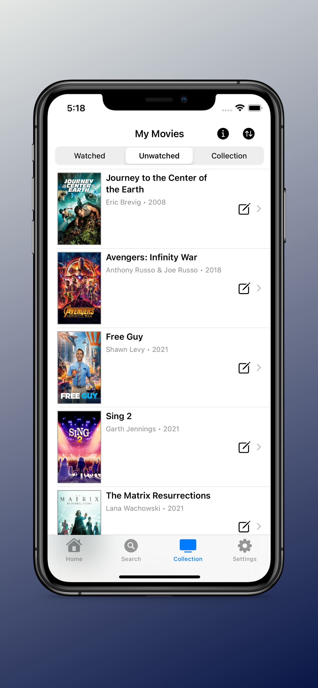
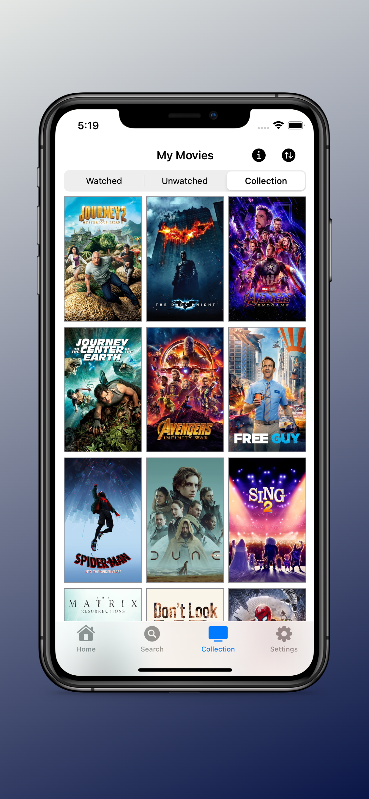
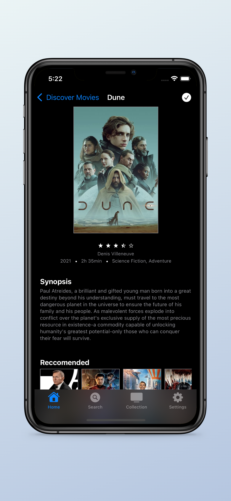
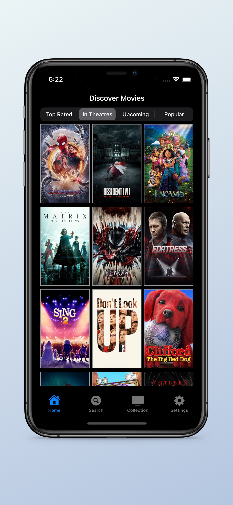
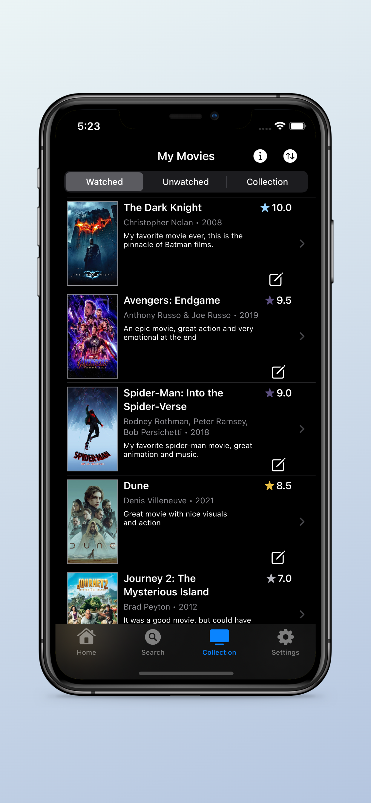
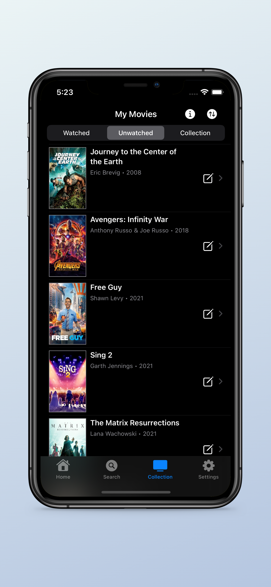
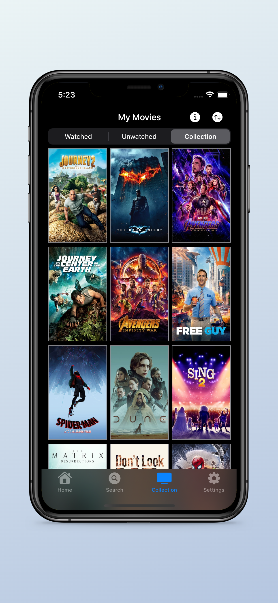

# My Movie Watch List 

MyMoviesWatchList is a lightweight & simple iOS application that is geared towards movie enthusiasts interested in keeping track of movies and discovering new movies to watch. This app is built using SwiftUI and is available on the iOS App Store. 

 
    
    
    
    
    
    
    
    
    

